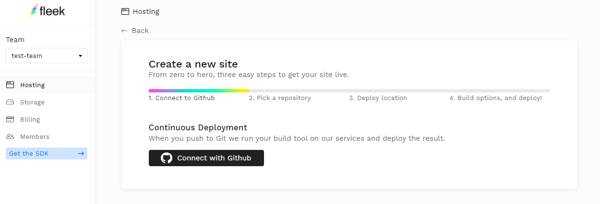
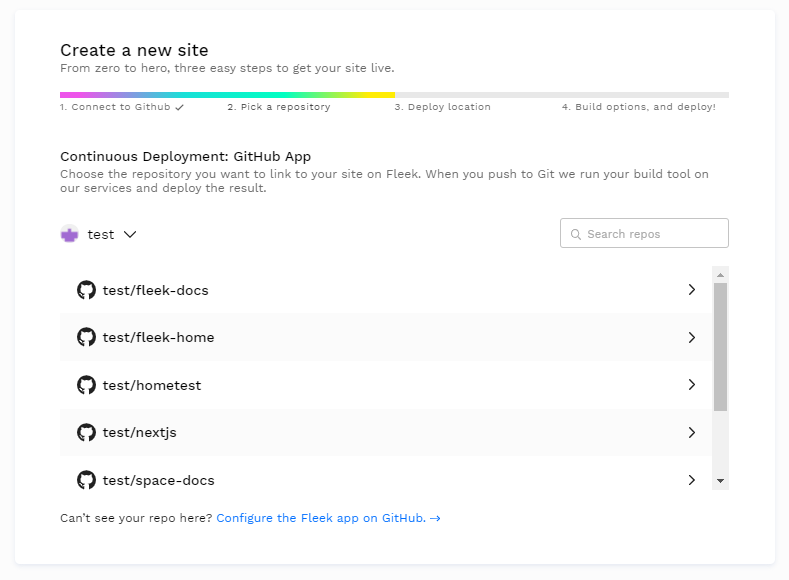
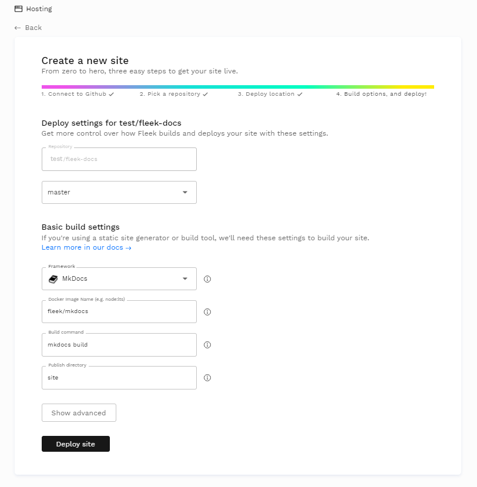
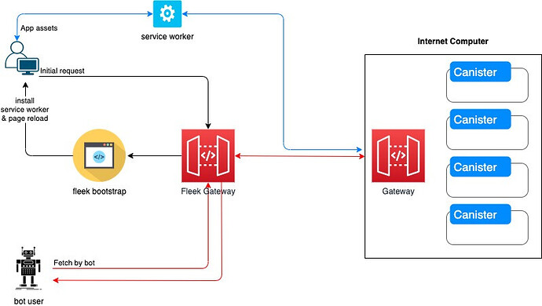
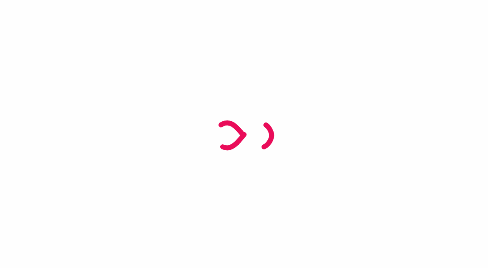
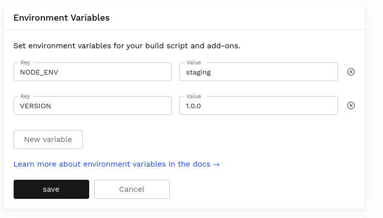

# Static Site Deployment on Dfinity

Deploying a static site to Dfinity on Fleek is as easy as it is to do so on IPFS, or the Web 2.0 services you know, but don't love much because of their trust-based or centralized approaches. 

With our GitHub integration there is no risk of outdated content, or delays. When you push to your repository, Fleek will pick up the changes and update your **canister on Dfinity's Internet Computer accordingly.**

## How Does Fleek Host Static Sites on Dfinity?
Before getting started, let us break down the flow on what is happening when you upload a site to the Internet Computer through Fleek.

When you first build a site on Dfinity through Fleek (on the site's first deployment), Fleek will **create a new canister on the Internet Computer** for you, with the website's content/code/files in it. This is done via the **Dfinity SDK** [(view documentation)](https://sdk.dfinity.org/docs/index.html), as Fleek interacts directly with the networks' native APIs.
&nbsp;

&nbsp;

&nbsp;

&nbsp;

Once your canister and first deployment is set, and your site is live, Fleek will update the content of that canister **upon each deployment** automatically. Meaning you will have one assigned front-end canister for each site you push to the Dfinity's Internet Computer.

!!! info

    IMPORTANT: At the moment, there is a 2.5GB (approximate) storage limit Dfinity canisters; and a 2MB per-file size limit. This doesn't affect most static websites, but can cause deployment errors when media assets like images, or videos are included. A quick an easy way to bypass this is to host/store media files on IPFS with Fleek! And embed them through the public/open URL we provide.

With Fleek's [Dfinity IC Gateway](https://docs.fleek.co/dfinity-hosting/dfinity-gateway-proxy/), we take care of power SSL certificates, custom DNS domains, and all necessary components to make your Canister-hosted static site reachable via the current web and HTTP. 

This set of tools that are part of the nexus between the current web (Web 2.0) and the next web (Web 3.0) will be progressively replaced. For example, by native support for Dfinity resolving on applications/websites that could help eliminate the need for bridges.

## Deploy a Static Site to Dfinity

### 1) Use the Fleek Native GitHub Integration



Visit the Hosting tab and **add a new site** to begin the process. **First, you will need to link your GitHub account** and define the repositories that Fleek will have access to for you to select from and deploy to Dfinity.

You will then select the proper repository where your static site is in, and the branch (if multiple are available) that will be used for deploying your site.



You will need to have a repository ready with static site public directory (most Jamstack frameworks are supported), and set the build settings. It is set and forget, so once your site is built and configured, you will benefit from **continuous deployments**. Just push your changed to the proper branch on GitHub, and done!

### 2) Select Dfinity as the Deployment Location


Got a repo and branch ready? Cool! Now, you will have to pick where you want to host your website. Dfinity, or IPFS. Open the dropdown menu and select Dfinity (should be the default option) and hit next.

Remember that when deploying to Dfinity, you are deploying to the Internet Computer computational blockchain. This is a decentralized and trustless environment that doesn't depend on Fleek. 

IPFS, on the other hand, is a distributed node environment that provides a user-controlled and performant location for sites, but it does depend on Fleek. Their perks and different, and both represent different approaches to Open Web hosting!

### 3) Configure the Deployment - Build Parameters
Fleek handles build parameters equally across Dfinity and IPFS. First, it will try to autodetect the site's framework and apply the standard build parameters.

**However in some cases** you might need to add the parameters manually (or you might want to customize them further). **Don't worry if you mistakenly place a wrong parameter**, these can be changed both here, and after the deployment in the site's **build settings.**



Below are the build parameters which you can modify.

- `Branch`: Right after your Repository, you can select the proper branch for your deployment.
- `Framework`: If Fleek doesn't auto-detect the proper framework, you can select one of our automatically supported ones from the list.
- `Docker image`: The name of the docker image on [docker hub](https://hub.docker.com/) in which your site will be built, defaults to `node:slim`. Fleek provides [images for many popular frameworks](https://hub.docker.com/orgs/fleek/repositories), but you can use any that suits your project.
- `Build command`: The commands to execute to build the site. EG: `npm install && npm run build`
- `Publish directory`: The name of the directory containing the `index.html` file of your site after it has been built

## Advanced Settings

- `Canister Proxying:` See below for detailed explanation
- `Environment variables`: The values of your environment variables. It is here for example that you might set your environment as `production`
- `Specify Docker Images`: Customize the docker image to fit your own needs/dependencies, or let Fleek auto-detect it

## Canister Proxy
With Fleek, you have **two different options** when it comes to Dfinity canister static site hosting resolving. 


- Using Fleek's Proxy as intermediary (middleman, no loading screen)
- Using Service Workers to go directly to Dfinity (no middleman, loading screen)

### Using the Proxy versus the Service Worker
Choosing one or another is a matter of preference. Do you want a seamless experience, but that depends on a middleman; or can you accept a change in the experience, but then decentralize further your resolving?



#### **The Fleek Proxy**
If you choose to **use Fleek as a proxy**, Fleek will use its Dfinity gateway to **act as a middleman** between users, and your static site canister on the Internet Computer, translating their requests. This is the default option, since it provides the most seamless experience for users and doesn't involve a Dfinity loading screen. However, this option does depend on Fleek's servers, or Fleek itself, as a middleman.

#### **Service Workers**
The alternative is to use **Service Workers** to connect to Dfinity directly. If you select this option, users will interact **once with Fleek´s gateway**, to receive a bootstrap script that installs a service worker and reloads their page, showing a quick animated loading screen (for a very few seconds). 



Once the Service Worker is installed, all of the user's requests will communicate directly with Dfinity's Internet Computer and your canister, **and no loading screen will be present**, that only happens once when the service worker is registered in their browser. This option **doesn't rely on Fleeks servers constantly**.

### Bots, Crawlers, and Other Non-human Requests
To ensure your static sites on Dfinity are bot-friendly, crawlable by search engines, and show their metadata and link previews (when shared on social, for example) **Fleek handles all bot requests through the Proxy and our Dfinity/IC gateway**.


## Environment Variables

Environment variables are exactly that: variables that exist on the machine that’s running your build. You can set up any amount of environment variables by clicking the New Variable button.



A typical use case is setting up an staging environment. You can do this by adding two sites pointing to the same repository, and then setting up the `NODE_ENV` variable differently in each site. Then, in your Node.js build script you can check for this variable by doing `process.env.NODE_ENV` and for example displaying a new feature only if `process.env.NODE_ENV === staging` so that the feature is only visible in your staging environment. That way you can test your new feature before it reaches all your users.

## Docker Images

We run builds inside a [Docker](https://www.docker.com/resources/what-container) container. Fleek will attempt to auto-detect the framework used in the project and fill the Docker Image settings with the appropriate Docker Image. However, any Docker image from Docker Hub can be used as a Docker image.

#### Fleek's Docker images

We provide Docker images for all the major frameworks such as Gatsby, Hugo, etc... These images can be found on Fleek's official Docker Hub org: <https://hub.docker.com/orgs/fleek/repositories>

In addition to support for multiple frameworks, Fleek supports variations within each framework, such as support for multiple Node versions. The Node version is specified from the Docker tag. For example, the image `fleek/gatsby:node-10` will use the version 10 of Node.js.
If no Node.js version is specified through the Docker tag, the image will use the latest version of Node.js. For example, `fleek/gatsby` is equivalent to `fleek/gatsby:latest` which is also the same as `fleek/gatsby:node-latest`, and they all use the latest Node.js version.

Also, a list of the Docker tags are available for each image on the image page on Docker Hub.
For example, here is the list of Docker tags for the `fleek/gatsby` image: <https://hub.docker.com/repository/docker/fleek/gatsby>

Finally, if you wish to see the Dockerfile from which each image is built from, the source code is made available on Github: <https://github.com/FleekHQ/site-builder-docker-images> 

#### Custom Docker Images
Sometimes, the Fleek Docker image is missing a dependency or two, or maybe you have few dependencies and want to use a leaner Docker image to speed up the build process. In these cases, it makes sense to use a custom Docker image.


!!! note
    You can see in our build logs which docker image was picked for your build.

To use a custom Docker image, you just need to fill the Docker Image input with a valid Docker name and tag from an image that exists in the Docker Hub. The [Docker Hub](https://hub.docker.com/) contains thousands of publicly curated images to choose from. We recommend choosing one of the official packages and making sure the version is compatible with your build settings. Also check that the syntax of your Docker Image input is correct, it should be in the format `[name]:[tag]`.

After the docker image has been selected, “Trigger Deploy” must be clicked in order to build the site using that image as the base.

Some popular options are:
- `jekyll/builder` for Jekyll
- `node:lts` for any other node-based environment.

If you can’t find a suitable Docker image for your project, you can always build and publish your own (it’s free!). To do so, head over to the official [Docker documentation here](https://docs.docker.com/docker-hub/publish/publish/).


## Common Website Frameworks

When you define the publish directory, if it is not automatically set, you can use this list of popular frameworks as a reference of the usual commands and public directory. You can find more guides on popular frameworks here [(hosting tutorials and guides).](https://sdk.dfinity.org/docs/index.html) Frameworks and build settings work **exactly the same** across IPFS/Dfinity.

All frameworks guides can be applied to both environments, the only difference being the moment you select the deployment location, where in this case you select Dfinity. 

| Framework          | Docker Image           | Build Command                       | Public Directory | Additional documentation |
|--------------------|------------------------|-------------------------------------|------------------|------------------|
| Create React App   | fleek/create-react-app | `yarn && yarn build`                | build            | <a href="https://blog.fleek.co/posts/fleek-create-react-app" target="_blank">Tutorial blog post</a> |
| Gatsby             | fleek/gatsby           | `yarn && gatsby build`              | public           | <a href="https://blog.fleek.co/posts/Gatsby-Fleek" target="_blank">Tutorial blog post</a> |
| Hugo               | fleek/hugo             | `yarn && hugo`                      | public           | <a href="https://blog.fleek.co/posts/go-with-hugo-and-fleek" target="_blank">Tutorial blog post</a> |
| Jekyll             | fleek/jekyll           | `jekyll build`                      | _site            | <a href="https://blog.fleek.co/posts/deploy-jekyll-blog-on-fleek" target="_blank">Tutorial blog post</a> |
| Next JS            | fleek/next-js          | `yarn && yarn build && yarn export` | out              | <a href="https://blog.fleek.co/posts/fleek-nextJS" target="_blank">Tutorial blog post</a> |
| Gridsome           | fleek/gridsome:node-12 | `yarn && yarn build`                | dist             | |
| Svelte             | fleek/svelte           | `yarn && yarn build`                | public           | |
| Svelte + Sapper    | fleek/svelte           | `yarn && yarn export`               | \__sapper__/export|
| MkDocs             | fleek/mkdocs           | `mkdocs build`                      | site             | |


### File configuration

Using a `.fleek.json` configuration file, placed at the root of a project, you can provide options that changes the default build behavior and overrides settings from UI (except secrets).

```json
{
 "build": {
   "image": "node:alpine",
   "command": "npm install && npm run build && echo $SOME_ENV",
   "publicDir": "build",
   "baseDir": "frontend",
   "environment": {
     "SOME_ENV": "Build finished!"
   }
 }
}
```

All these fields are optional:

- `image` public docker image, default to node:slim
- `command` no command is executed by default
- `baseDir` build command is executed in this directory, root directory is used by default
- `publicDir` this directory is uploaded to Dfinity, `baseDir` is used by default
- `environment` key/value object of environment variables

If you use `baseDir = /frontend` and `publicDir = /dist`, published path is `/frontend/dist`. If you need to publish directory above or next to your `baseDir`, you can use relative path `publicDir = ../../dist`.


## Monitoring a deployment

Fleek offers a host of logging tools to aid in monitoring your site.

### Deploy Logs
The deploy log includes all of the standard output which comes from running your build as well as Fleek-specific information about dependency caching, Fleek configuration file processing, and more. 


### Deploy Summaries


You can find a deploy summary on the detail page of any successful deploy, right above the deploy log. It allows you to quickly identify your deploy status and refer to the details in the log based on different types of information.

The summary contains details such as the presence of Redirect rules and Header rules.

## Previewing a deployment
### Deploy previews
Deploy previews allow you to preview a deployment before pushing it to production. You can safely view what your site will look like before you merge the pull request.

It should come in handy when you want to make sure that everything is in order with the changes you want to make and avoid bad surprises due to unfortunate oversights.

### Activating deploy previews
The feature must first be activated since it is deactivated by default. You can do so by going to the site's settings, clicking on `Build & Deploy` and interacting with the `Deploy Contexts` box.


### Viewing deploy previews
To start a deploy preview, simply create a pull request to your production branch. The deploy preview will appear in the list of deploys of the site.

Click on the deploy tagged `Deploy Preview` to view it!


In addition, you are able to view the deploy preview right from the github page of your pull request. Very handy for developers wanting to see the changes resulting from a pull request!


## Testing deployments locally

We're using docker containers to execute your builds, so you can test them locally with Docker. Here's a sample docker-compose.yml, we're using Verdaccio as a local npm proxy (it's not supported for production builds).

```yaml
version: '3.7'
services:
  verdaccio:
    container_name: verdaccio
    image: verdaccio/verdaccio
    ports:
      - "4873:4873"

  app:
    image: $IMAGE
    command: sh -c 'npm set registry http://verdaccio:4873 && $BUILD_COMMAND'
    working_dir: /workspace/$BASE_DIR
    environment: $ENVIRONMENT
    volumes:
      - './path/to/app:/workspace/$BASE_DIR'
```

### Example of Gatsby Site Testing

You can execute the configuration below with command `docker-compose run -it --rm app`.

```yaml
version: '3.7'
services:
  verdaccio:
    container_name: verdaccio
    image: verdaccio/verdaccio
    ports:
      - "4873:4873"

  app:
    image: fleek/gatsby
    command: sh -c 'npm set registry http://verdaccio:4873 && npm install && npm run build'
    working_dir: /workspace
    volumes:
      - './path/to/app:/workspace'
```


## Deleting a deployment
### Deleting a Site


Deleting a site is an irreversible action so proceed with caution.

To delete a site, go to the settings of the site and navigate to General > Danger Zone. A modal will then appear with a warning and instructions to delete the site.