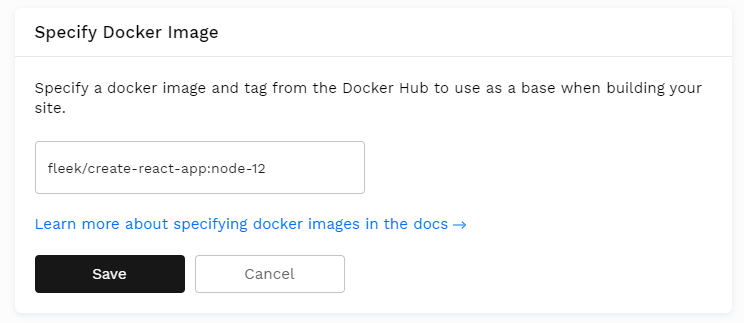
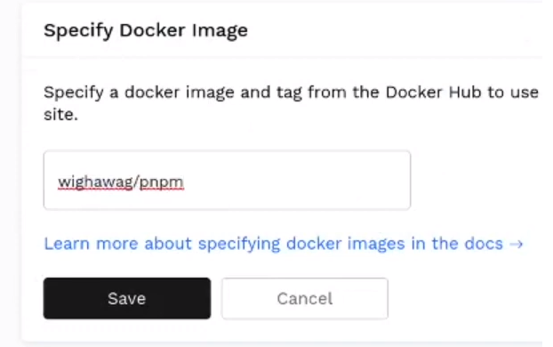

# Troubleshooting

## Dfinity-specific Limitations and Common Issues
### File Size and Canister Storage Limit
Currently, there is a temporary file size and storage limitation involved in Dfinity canisters. There is an approximate 2.5GB total canister storage limit (meaning, your entire repository can't go above that number).

Secondly, there is a 2MB per-file size limit, independently of the total storage utilized on the canister. Usually, this doesn't affect **static sites**. However, it might affect files included and utilized in the website, such as **images, videos, gifs, audio**, or any file with tendency to go above 1MB. Media, naturally, is the most affected.

To bypass this issue, you can **host and store files in Fleek's IPFS storage** and embed them into your Dfinity hosted site with their public URL. View our Storage [(documentation)](https://docs.fleek.co/storage/storage-app/) for more information.

## Build Troubleshooting Tips

Before getting started on specific tips, the most important thing you should check first is to **build your file locally in the development environment**. If it builds locally, but not non Fleek, then you should verify dependencies and follow tips below.

### Verify you are Using the Correct Node Version
When you are working on your site locally, you are using a particular Node.js version. If when uploading and building on Fleek, it fails, you must verify that you are using a compatible Node.js version Fleek when building.

Visit your Fleek account, go into the site's details and into the failed deployment's log. There you should see an error as the following "error node-version...".   In this case, it expected version 12 and got 15.2.1.

The fix is easy. You have to visit the **Build & Deploy** tabs in your website's settings, and find the **Specify Docker Image** section. By default **Fleek uses the latest Node.js available, always**. So, you must edit this settings and **add a tag to specify the Node.js version you want to use**:

### Double Check Dependencies
If the problem persists, you might be missing a dependency that you have locally but not on Fleek. To troubleshoot this, visit your **failed deployment logs**, and see if there was an element that was not found. In the example below, you can see the /bin/sh: 1: pnpm was not found.

 

This means there is a dependency that is missing (pnpm). **How do you fix this?** Even if you put the right build command, if the dependency is not installed like it is locally, Fleek won't be able to use the build commands necessary to create your deployment.

So, to fix this you will need to **Specify a Docker Image** that contains the missing dependency (pnpm in this case). You can create and specify your own, or go on Docker Hub and search for one that is compatible https://hub.docker.com/. 

Once you find, build or specify one. Simply hit trigger deploy on top of your failed deployment, and test again.

### Verify the Publish Directory

The public directory is always relative to the base directory. So to use the `public` folder in the project root simply input `public` for the public directory field.

**How do I know if I have the right publish directory?** This varies depending on the framework you use. A simple way to find it is to **build it locally** and see the build folder that it appears and its name.

| Framework          | Docker Image           | Build Command                       | Public Directory | Additional documentation |
|--------------------|------------------------|-------------------------------------|------------------|------------------|
| Create React App   | fleek/create-react-app | `yarn && yarn build`                | build            | <a href="https://blog.fleek.co/posts/fleek-create-react-app" target="_blank">Tutorial blog post</a> |
| Gatsby             | fleek/gatsby           | `yarn && gatsby build`              | public           | <a href="https://blog.fleek.co/posts/Gatsby-Fleek" target="_blank">Tutorial blog post</a> |
| Hugo               | fleek/hugo             | `yarn && hugo`                      | public           | <a href="https://blog.fleek.co/posts/go-with-hugo-and-fleek" target="_blank">Tutorial blog post</a> |
| Jekyll             | fleek/jekyll           | `jekyll build`                      | _site            | <a href="https://blog.fleek.co/posts/deploy-jekyll-blog-on-fleek" target="_blank">Tutorial blog post</a> |
| Next JS            | fleek/next-js          | `yarn && yarn build && yarn export` | out              | <a href="https://blog.fleek.co/posts/fleek-nextJS" target="_blank">Tutorial blog post</a> |
| Gridsome           | fleek/gridsome:node-12 | `yarn && yarn build`                | dist             | |
| Svelte             | fleek/svelte           | `yarn && yarn build`                | public           | |
| Svelte + Sapper    | fleek/svelte           | `yarn && yarn export`               | \__sapper__/export|
| MkDocs             | fleek/mkdocs           | `mkdocs build`                      | site             | |

## Command not found

* If your build fails with the `command not found`, then your dependencies have not been installed. To install your dependencies, upload a configuration file such as `package.json` for NodeJS programs listing all of the required dependencies.

## Build fails with 'exit status 128'

* If your build is failing with `exit status 128`, this likely means that we no longer have access to your GitHub repository. Ensure that your repo is public or that you gave us access by signing in through GitHub when providing the link to the repo.

## Large files or sites

* Sites with many thousands of HTML files can often take a significant amount of time to deploy
    
## Enqueued builds

* System queue
    * This occurs when the number of builds across all of our customers exceeds our current network capacity. When this happens builds will be queued as they come in and be deployed when other builds finish
* Team queue
    * This occurs when the number of total builds across all of your sites exceeds the build limit. You can increase your concurrent builds by upgrading your account or by contacting support. If you have this issue, you can cancel other builds that may not be as important.
