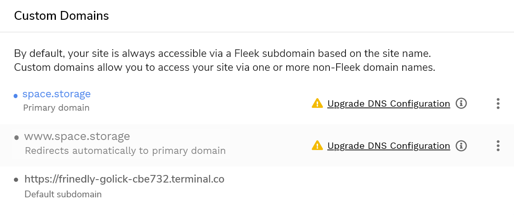
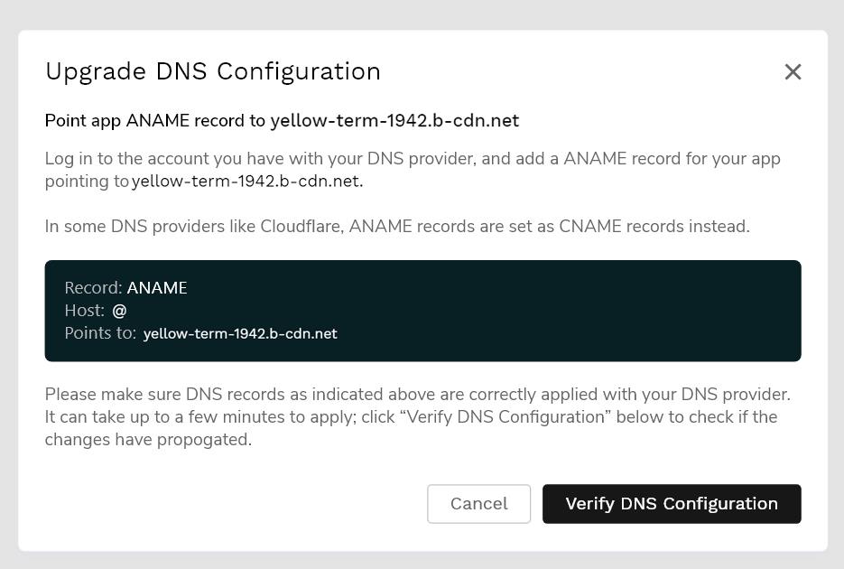

# Custom DNS Domains
 Upon site creation, Fleek will automatically assign a domain name depending on if your site is hosted on IPFS or the Internet Computer.
 
If your site is hosted on IPFS, it will be assigned a random name in the following way: [RANDOM_NAME].on.fleek.co. Of course, we allow users to point the site to a custom domain of their choice or change this random name if a different one is available.

If your site is hosted on the Internet Computer, Fleek will automatically assign a domain name in the following way: [CANISTER_ID].ic.fleek.co. For example, it could look like this: `https://x4ytk-6yaaa-aaaab-qaiqq-cai.ic.fleek.co/`

!!! info

    As of May 2021, we've upgraded our DNS custom domain configuration to unlock extra CDN features, automatic and scalable DDOS protection, and other perks like perma-caching for all sites/apps using DNS names on Fleek. This new setup requires that your DNS service/provider supports ANAME.

    If you set up your DNS domain before May 2021, you need to migrate to this new configuration before May 31st, where all sites using the legacy proxy/DNS will stop working.
    
    See the section "Upgrading to New DNS Configuration".

### Adding a Custom Domain 

1. Go to your site's page and select `Add or register domain`
2. Enter the domain you would like to add
3. From here you will either have to confirm that you already own this domain or if you do not own the domain name and that it is available.

The process for adding a custom DNS domain **is the same for both IPFS & Internet Computer sites/apps**.

### Verifying the Custom Domain
After adding the custom domain, it will appear in the site's settings under `Domain Management` > `Domains`.

The domain must be verified before it is linked to the site. To verify, click on the `Check DNS configuration` button. This will make a modal appear containing instructions to add the domain.
Follow the instructions in the modal. The steps to update the records might be slightly different depending on your domain name provider.
We then must wait for the domain to be propagated before clicking on `Verify DNS configuration` on the modal.

To verify that the DNS is indeed propagated before clicking on the button, you can use a tool such as <https://dnschecker.org/>

If the verify dns was successful, the domain name will become blue.

## Upgrading to New DNS Configuration

If you setup your Fleek site/app with a DNS domain before May 2021, you are using our old DNS configuration with HAProxy, and will need to update your DNS records. 

Since then, we have upgraded to a new infrastructure that uses BunnyCDN to provide users that utilize DNS domains with CDN & security perks:

- Automatic DDOS/HTTP attack protection
- Perma-caching
- Faster auto-routing

There is a difference in how to upgrade your DNS settings depending whether you use Cloudflare as your DNS provider, or not. See the separate sections below.

### Requirements for Upgrading DNS

This new infrastructure requires you that your DNS service/provider where you acquired your domain supports **ANAME records**. Make sure your provider does so **before trying to upgrade**, or move to a new provider if needed. 

**Does you DNS provider not support ANAME?** You can point your domain to Cloudflare name server and use their DNS service. It's free, and it supports ANAME records. [Find more details on this here.](https://support.cloudflare.com/hc/en-us/articles/205195708-Changing-your-domain-nameservers-to-Cloudflare)

### How to Upgrade (Non Cloudflare Providers)

To migrate your site log into your Fleek account, and do this for every site that uses a custom DNS domain. Once you're logged in, visit the hosting tab, and click on a site on the list to get started.

Once inside a site's detail view, visit the SETTINGS tab and there, look for the Domain Management tab on the vertical sub-menu.

There, you will see the Custom Domains section, showing the Custom DNS Domain name you set up and connected to your Fleek site/app. Click on "Upgrade DNS Configuration" to re-configure your site.

In a nutshell, you will need to update the records on your DNS domain. This is because your custom domains need to point to Fleek's new upgraded infrastructure. 

Root domain names (space.storage) will ask for an ANAME record, whereas any subdomain or www. domain (like www.space.storage) will use CNAME.

**What about DNSLink domains?** Those will continue to point to your Fleek-assigned subdomain and a CNAME record, so keep them that way for now.

**Some providers**, ANAME records are inputted as CNAME, so verify with your provider's documentation first. You might see ANAME records called as ALIAS as well.

Once you have updated your records on your DNS provider, come back to Fleek to Verify the DNS Configuration once you do so. 

That is all! Your site will be updated to our new faster, and safer, DNS infrastructure.

### How to Upgrade (Using Cloudflare as Provider)

If you are using Cloudflare, as in pointing your domains to their name servers to use Cloudflare's DNS service, you can still upgrade your DNS records to the new DDOS protected infrastructure. 

**Follow the instructions above, with these two slight differences:**

1. In Cloudflare, ANAME records need to be set as CNAME records.
2. You need to turn Orange Cloud OFF (disabling HTTP proxy mode) in Cloudflare for your DNS domains.

If you **don´t turn off the Orange Cloud/Proxy** for your domain when setting your DNS records on Cloudflare, your custom domain will **fail its DNS verification on Fleek**.

To do so, visit the **DNS App** in Cloudflare, and edit your DNS records, there you can **Click the orange cloud on each record** to turn it OFF (Grey).

If you wanted to have that Cloudflare feature on because of its CDN perks and DDOS protection, don't worry, **you will have access to those features through us and BunnyCDN**, which is the reason why we upgraded our DNS configuration.

### How to Upgrade (Using Google Domains)
There is a workaround for people using Google Domains that don't want to use Cloudflare. This trick could apply to other providers that offer domain forwarding to sub domain from apex domain.

Here is a a [detailed guide on how to do so](https://support.getshifter.io/en/articles/3080501-domain-forwarding-on-google-domains-zone-apex-naked-domain-to-www-prefixed-domain). The idea is that Google Domains doesn't support ANAME/ALIAS records for apex domains (domain.com). But what **you can do** on Google Domains is forward that apex domain to a sub domain (www.domain.com).

In Fleek, subdomains use CNAME records, therefore you could verify it doing this trick, making www. your main point of entry for your website.