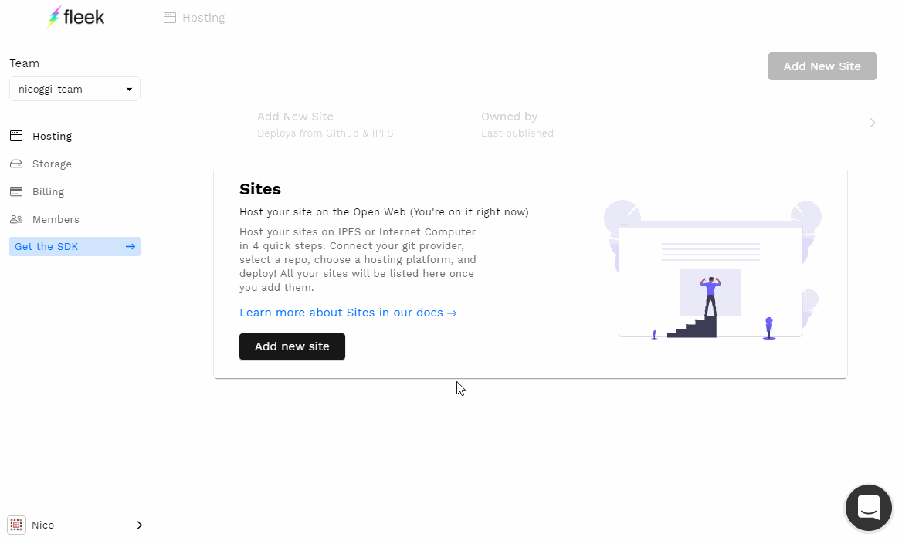
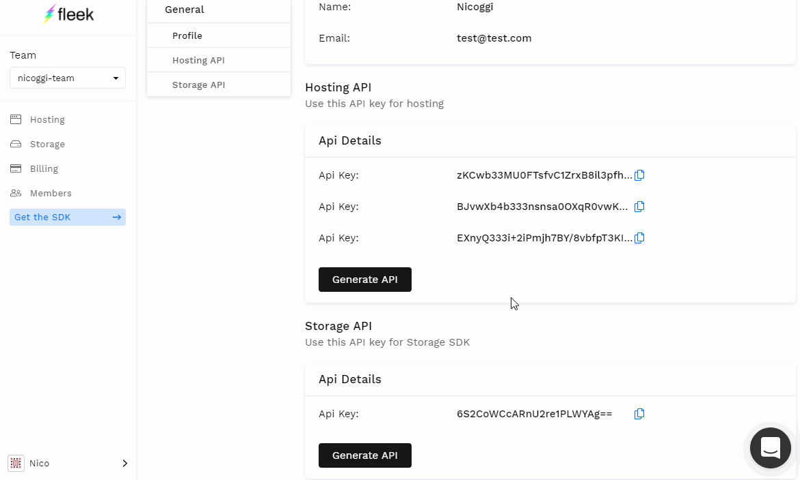

The Fleek API is a simple GraphQL API that exposes **Hosting** functionalities to manage sites in the Fleek platform, fetch data from them, or trigger new deployments.

The API is accessible at [https://api.fleek.co/graphql](https://api.fleek.co/graphql) and requires an API Key to authenticate yourself. Right now you can use the API's schema to navigate and learn all available queries and mutations, we will expose a GraphQL playground in the near future as an alternative to this.

<div class="prev-boxes-list">
  <a href="https://docs.fleek.co/fleek-api/schema" class="prev-box">
    <h5>GraphQL Schema</h5>
    <p>View All Queries and Mutations</p>
  </a>
  <a href="#hosting-api-key" class="prev-box">
    <h5>API Keys</h5>
    <p>Generating an API Key</p>
  </a>
  <a href="#authenticatio" class="prev-box">
    <h5>Authentication</h5>
    <p>Authenticating Against the API</p>
  </a>
    <a href="#query-examples-and-uses-cases-for-the-ap" class="prev-box">
    <h5>Query Examples </h5>
    <p>Fetch Data, Trigger Deploys</p>
  </a>
</div>

---
## Hosting API Keys
To authenticate the API, you need to generate an API Key for your team by going to the settings screen of the corresponding team. 

Generate a Sites API Key by going to your [Fleek account](https://fleek.co), and visit the settings menu where you will find the Hosting Api Key Generator.


Here you will find the **Hosting API Key** generator, which you can use to create several different Hosting keys for your different projects or implementations. Generate a new one, and save it for the next step.



## Authentication
To authenticate against the API, pass your API Key as the `Authorization` header to the request, this will be use to authenticate the request against the team the key was generated for.

Example curl request can be authenticated like so:

```jsx
curl -H "Authorization: <fleek-api-key===>" \
	-H "Content-Type: application/json" \
	-d '{"query": "{ __typename }"}}' \
	https://api.fleek.co/graphql
```

Most GraphQL client libraries have some way to add headers to all your requests. Here's a JavaScript example with [Apollo Boost](https://www.npmjs.com/package/apollo-boost).

```jsx
import ApolloClient from 'apollo-boost';

const fleekApiKey = process.env.FLEEK_API_KEY;
const client = new ApolloClient({
    uri: 'https://api.fleek.co/graphql',
    fetch: fetch,
    headers: {
        authorization: fleekApiKey
    }
});
```
## Query Examples and Uses Cases for the API

### 1. Fetching Details About a Site and its Published Deployment

The following snippet is an example query to get details about the published deployment for a site on Fleek.

```graphql
query {
	getSiteBySlug(slug: "site-name-here") {
		id
		name
		platform
		publishedDeploy {
			id
			status
			ipfsHash
			log
			completedAt
		}
		team {
			id
			name
		}
	}
}
```

### 2. Triggering a New Deployment on Existing Site

To trigger a new deployment on an existing site:

```graphql
mutation {
	triggerDeploy(siteId: "site-id", commit: "") {
		id
		status
	}
}
```

NOTE: `siteId` is different from site name/slug, you can get the id from the `[Site.id](http://site.id)` field of the `Site` type. Also, the `commit` input is not required, omitting it would deploy the latest commit on the configured sites repository branch.

You can can then query the status of the latest deployment using the following query:

```graphql
query {
	getSiteById(siteId: "site-id") {
		id
		latestDeploy {
			id
			status
		}
	}
}
```

> Note: Currently  to actively monitor the status of a deploy you would have to either manually watch it in the Fleek Dashboard or poll one of the deploy queries to know when there is a status update. We will be releasing a webhooks solution later to make updates easier to monitor.