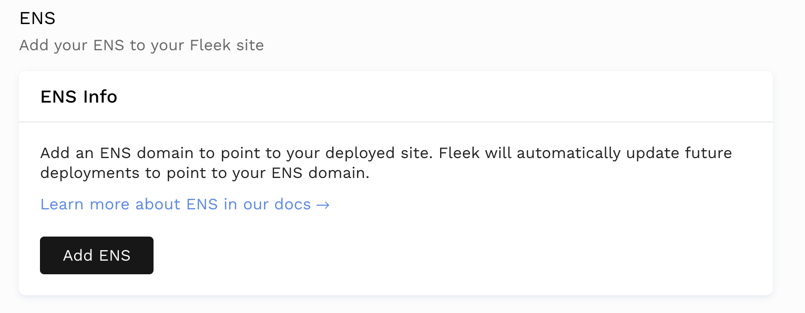
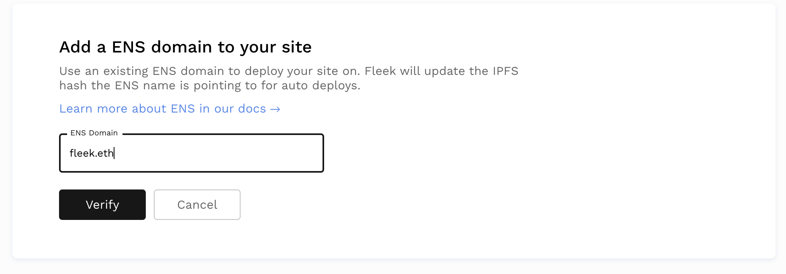
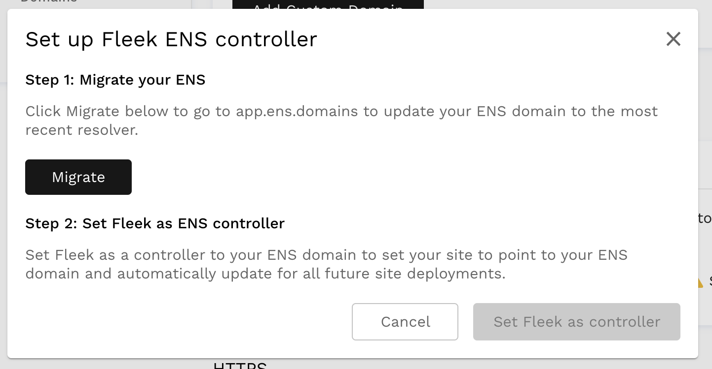

# ENS Domains

You can now easily point an ENS domain to your IPFS site and have the content automatically update for future deployments. Here is how to set up an ENS domain for your site:

## Deploying

Once your app is deployed on Fleek, go to the settings page in the left-hand bar menu and click `Domain Management`. Scrolling a bit would land you on the section that says `ENS`

## Adding ENS Domain

Click Add ENS to add your ENS domain. Input your domain to verify it and add it. If the domain does not belong to anyone you will be redirected to the [ENS Dashboard](https://app.ens.domains) to buy it.

NOTE: Your domain will appear in the settings page and can also be deleted from there.

## Set Fleek as the Controller through the UI

Fleek needs to be a controller of your ENS domain so we can automatically update your domain content hash when a site deployment succeeds. Click the `Set Fleek as Controller` button to set this up.

If the domain is using the old ENS resolver, you will be prompted to migrate to the latest resolver. By clicking on the `Migrate` button, you will be redirected to the [ENS Dashboard](https://app.ens.domains) to complete the migration.

Finally, clicking on the `Set Fleek as controller` button will trigger a modal to connect an Ethereum web3 provider, such as [Metamask](https://metamask.io/). If using Metamask, a popup will appear asking to connect. After, another popup will appear to accept the Ethereum transaction to set Fleek as controller.

On the Settings section, the domain will show that the Ethereum transaction is pending confirmation. Upon confirmation, the ENS domain will have been successfully added to Fleek. 

## Set Fleek as Controller manually
The Fleek controller can also be set manually through the official [ENS frontend](https://app.ens.domains), or by interacting directly with the smart contracts.

The value for the controller address must be `0x31166ec8996643A35c2cf8cEbED980e26cd89D06`, which corresponds to the Ethereum address of Fleek's controller.

After manually setting the controller, adding the ENS through the app will work normally, except that Fleek will detect that the controller is already set and will complete the setup without executing an Ethereum transaction.

## Troubleshooting
* You can quickly test that the ENS domain is correctly synced with the IPFS hash of the current build by appending `.link` after the domain. EG: <https://fleekhq.eth.link>

* You must ensure that your browser is able to resolve ENS domains. You can test this functionality with Fleek's homepage: [fleek.eth/](https://fleek.eth/).

* It's possible the link doesn't immediately work. Most browsers, if not all of them, will redirect the user to an IPFS gateway and it is possible that the content for that IPFS hash has not yet propagated to the gateway. Wait a few minutes if that is the case.