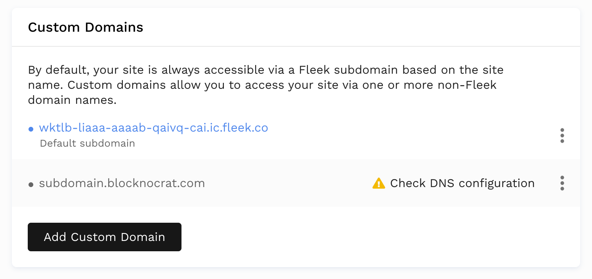
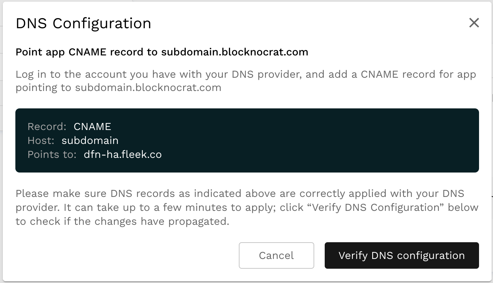

### Custom Domains
 Upon deploying a site on Internet Computer hosted sites/apps, Fleek will automatically assign a domain name in the following way: [CANISTER_ID].ic.fleek.co. For example, it could look like this:

 `https://x4ytk-6yaaa-aaaab-qaiqq-cai.ic.fleek.co/`
 
This domain is created through Fleek's Internet Computer Gateway, our own open source transdimensional portal to the IC. With Fleek's IC Gateway, you can surface and access **any canister on the Internet Computer, not just Fleek-hosted ones**. Just replace the Canister ID on the URL with the desired canister, and you're ready.

But, aside from this auto-generated domain, on Fleek we allow users to point their IC-hosted sites to a custom domain of their choice.

!!! info

    As of May 2021, we've upgraded our DNS custom domain configuration to unlock extra CDN features, automatic and scalable DDOS protection, and other perks like perma-caching for all sites/apps using DNS names on Fleek. This new setup requires that your DNS service/provider supports ANAME records.

    If you set up your DNS domain before May 2021, you can migrate to this new configuration. See the section "Migrating to New DNS Configuration".

## Adding a Custom Domain

1. Go to your Internet Computer hosted site's page and select `Add or register domain`
2. Enter the domain name that you would like to add
3. From here you will either have to confirm that you already own this domain or if you do not own the domain name and that it is available, you can buy it through Fleek.

### Verifying the Custom Domain
After adding the custom domain, it will appear in the site's settings under `Domain Management` > `Domains`.

The domain must be verified before it is linked to the site. To verify, click on the `Check DNS configuration` button. This will make a modal appear containing instructions to add the domain.

Follow the instructions in the modal. The steps to update the records might be slightly different depending on your domain name provider. We then must wait for the domain to be propagated before clicking on `Verify DNS configuration` on the modal.

To verify that the DNS is indeed propagated before clicking on the button, you can use a tool such as <https://dnschecker.org/>

If the verify dns was successfull, the domain name will become blue.

### Migrating to New DNS Configuration (DDOS Protected, Faster)
If you setup your Fleek site/app with a DNS domain before May 2021, you are using Fleek's old infrastructure with HAProxy.

Since then, we have upgraded and migrated to a new infrastructure that uses BunnyCDN to provide users that utilize DNS domains with scalable and automatic DDOS/HTTP attack protection, perma-caching, and faster auto-routing for high availability.

**Important requirement**: This new infrastructure requires you that your DNS service/provider where you acquired your domain supports **ANAME records**. Make sure your provider does so before trying to migrate, or move to a new provider if needed.

To migrate your site log into your Fleek account, and do this for every site that uses a custom DNS domain. Once you're logged in, visit the hosting tab, and click on a site on the list to get started.

(Image)

Once inside a site's detail view, visit the SETTINGS tab and there, look for the Domain Management tab on the vertical sub-menu.

(Image)

There, you will see the Custom Domains section, showing the Custom DNS Domain name you set up and connected to your Fleek site/app. Click on the "Upgrade DNS Button" to re-configure your site.

(Image)

In a nutshell, you will need to update your CNAME record on your DNS domain. This is because your custom domains needs to point to Fleek's new upgraded infrastructure.

(Image)

Once you have updated your CNAME record on your DNS provider, come back to Fleek to Verify the DNS Configuration. That is all! Your site will be updated to our new faster, and safer, DNS configuration.

## HNS Domains

With Fleek you can also add [Handshake](https://handshake.org/) (HNS) domain names from the Handshake protocol/blockchain. This alternative to DNS/ENS is a decentralized naming protocol in which you don't buy domains themselves, but Top Level Domains (TLDs) like .domain or .fleek.

You can then create domains inside those TLDs and use them just like DNS on your Fleek-hosted site, via the HNS flow. To buy a new domain name, go to [Namebase](https://www.namebase.io/).

### Adding HNS Domains

Visit the `Domain Management` after deploying a site on Fleek, and search for the `HNS` section. HNS works exactly like DNS in terms of the workflow you must complete to link it to your Fleek site:

1. You add or buy your HNS domain
2. You verify it via a custom record
3. You redeploy your site

If you enter a domain that already has been purchased, you will be asked to confirm if it is yours; if it is not purchased yet, you will have the option to be redirected to Namebase to do so.

### Configuring Records

Finally, once you add or purchase a new HNS domain, you must do just like with DNS domain names: you need to configure a custom record so that it is properly linked and verified.

You can use Namebase to do so, via their UI, or your own custom Nameserver to add the record that points to your app to your domain. That is all! Once you are done, you will have an HNS domain pointing to your Fleek-hosted project.

### Accessing / Resolving HNS Websites

Handshake domains live on the Handshake blockchain, much like ENS names live on Ethereum, and are not yet fully supported/resolved but most browsers.

While that situation changes, you still have several options for resolving your HNS website. You can use [**hns.to**](https://hns.to/) to quickly verify that your new  site is up. hns.to is a Handshake resolver, you can use its search engine to find your site, or append at the end of your HNS domain name `my.site.hns.to` to view it over HTTP.

Another option is to use an **HNS compatible browser or extension**, [like PUMA](https://www.pumabrowser.com/), or the [LinkFrame extension](https://chrome.google.com/webstore/detail/linkframe/klcheodcjdbkbiljlcfiphagmkhbifmm?hl=en-US&authuser=0) for Chrome. 

If you want, you can also change your **devices' DNS** to point to HNS resolving ones, like [HDNS](https://www.hdns.io/); or go all the way and install **Handshake's node,** [**hds **](https://hsd-dev.org/)to resolve their domains trustlessly.

For more options, visit [Namebase's guide](https://learn.namebase.io/starting-from-zero/how-to-access-handshake-sites#level-3-dns) detailing all available options by technical level.

## ENS Domains on the Internet Computer
Currently, there is no native implementation of Ethereum Name Service domains on the Internet Computer. We are working together with the involved parties to make this a possibility soon, so stay tuned!