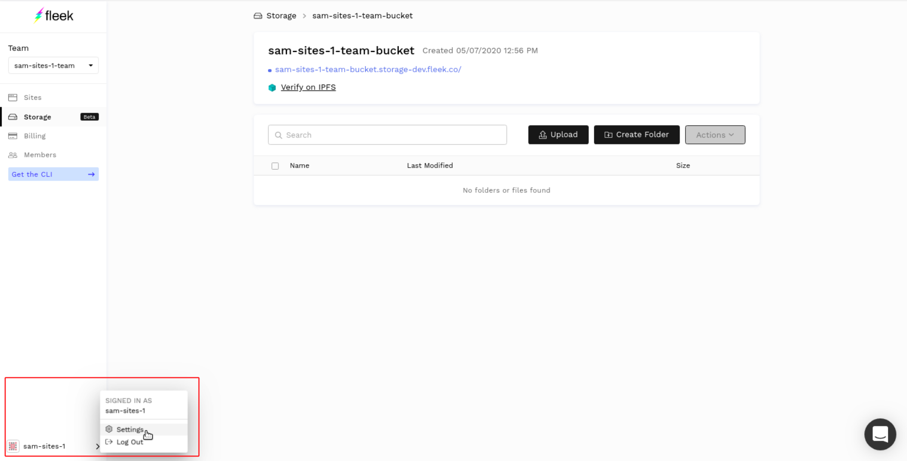
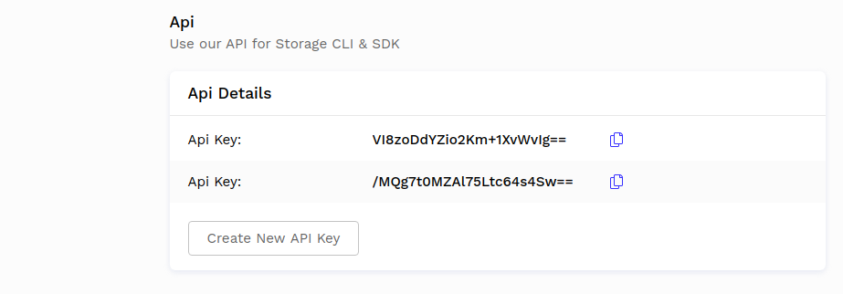

Fleek provides everything you need to securely store files on IPFS and distribute them for the web applications.

Fleek Storage JS is an SDK that will allow you to easily interact programatically with Fleek Storage. It allows getting file contant, hash, publicUrl, and uploading files.

## Getting the API key

### From the Fleek CLI

The [Fleek CLI](https://www.npmjs.com/package/@fleekhq/fleek-cli) is a tool that allows access to Fleek's products from the command line.

### Installation

```sh
npm install -g @fleekhq/fleek-cli
```

Run the following command:

```sh
fleek login
```

It should open a browser window prompting you to log in. If you are already logged in, it will automatically close the browser window and generate the keys.

Next, run the command

```sh
fleek  whoami
```

Take note of the fields apiKey and apiSecret which will be needed in the next step.

### From the Web app

You can also generate a new api key from the Web app at [app.fleek.co](https://app.fleek.co).

The api generator is located in the user settings.



The new keys can be generated in the api section by clicking on `Create API keys`.
Make sense to copy the secret somewhere because it is only visible once.



## Installing NPM Package

The package can be installed through npm.

```sh
npm install @fleekhq/fleek-storage-js
```

It can also be installed through yarn.

```sh
yarn add @fleekhq/fleek-storage-js
```

### Importing

The SDK can be imported using an `import` statement.

```js
import fleekStorage from '@fleekhq/fleek-storage-js'
```

The SDK can also be imported using a `require`.

```js
const fleekStorage = require('@fleekhq/fleek-storage-js')
```

## Methods

### get

The `get` method is for fetching individual files, either the content or related data, such as the key, hash and publicUrl.

Example of usage:

```js
const myFile = await fleekStorage.get({
  apiKey: 'my-key',
  apiSecret: 'my-secret',
  key: 'my-file-key',
  getOptions: [
    'data',
    'bucket',
    'key',
    'hash',
    'publicUrl'
  ],
})
```

**Input parameters of get:**

|param  	|type  	|description  	|
|-:	|-	|-	|
| apiKey 	| String 	|  The api key used for authentication	|
| apiSecret 	| String 	|  The api secret used for authentication	|
| key 	|  String	| The key identifying the requested file in the bucket  	|
| bucket 	| String, optional, defaults to the default account bucket 	|  The name of the bucket containing the file. A bucket is created by default with every Fleek account	|
| getOptions 	| Array, optional, defaults to ['data'] 	| An array specifying what type of information to retrieve concerning the file.	Possible values for the array includes `data`, `bucket`, `hash`, `key`, `publicUrl`|

### upload

The `upload` method uploads a file, identified by a key, to a bucket.
The function returns the hash of the file, the publicUrl, the key and the bucket.

Example of usage:

```js
fs.readFile(filePath, async (error, fileData) => {
  const uploadedFile = await fleekStorage.upload({
    apiKey: 'my-key',
    apiSecret: 'my-secret',
    key: 'my-file-key',
    data: fileData,
  });
})
```

**Input parameters of upload**

|param  	|type  	|description  	|
|-:	|-	|-	|
| apiKey 	| String 	|  The api key used for authentication	|
| apiSecret 	| String 	|  The api secret used for authentication	|
| key 	|  String	| The key identifying the requested file in the bucket  	|
| bucket 	| String, optional, defaults to the default account bucket 	|  The name of the bucket containing the file. A bucket is created by default with every Fleek account	|
| data 	| Any 	| The data of the file to be uploaded |

### listFiles

The `listFiles` method is for fetching information about all files in a bucket such as the key, hash and publicUrl.

Example of usage:

```js
const files = await fleekStorage.listFiles({
  apiKey: 'my-key',
  apiSecret: 'my-secret',
  getOptions: [
    'bucket',
    'key',
    'hash',
    'publicUrl'
  ],
})
```

**Input parameters of listFiles**

|param  	|type  	|description  	|
|-:	|-	|-	|
| apiKey 	| String 	|  The api key used for authentication	|
| apiSecret 	| String 	|  The api secret used for authentication	|
| bucket 	| String, optional, defaults to the default account bucket 	|  The name of the bucket containing the file. A bucket is created by default with every Fleek account	|
| getOptions 	| Array, optional, defaults to ['key', 'bucket', 'publicUrl'] 	| An array specifying what type of information to retrieve concerning the file.	Possible values for the array includes `bucket`, `hash`, `key`, `publicUrl`|

### listBuckets

The `listBuckets` method returns an array of bucket names associated with the api key's account.

Example of usage:

```js
const buckets = await fleekStorage.listBuckets({
  apiKey: 'my-key',
  apiSecret: 'my-secret',
})
```

**Input parameters of listBuckets**

|param  	|type  	|description  	|
|-:	|-	|-	|
| apiKey 	| String 	|  The api key used for authentication	|
| apiSecret 	| String 	|  The api secret used for authentication	|

### getFileFromHash

`getFileFromHash` is a utility function that downloads a file's data from {Fleek's IPFS gateway](/#fleeks-ipfs-gateway) using the hash. The key and secret is not required since the gateway is publicly available.

Example of usage:

```js
const myFile = await fleekStorage.getFileFromHash({
  hash: 'bafybeige4bhzjvrptn7fdz7mqgigzoczcliqpuo7km4jm7vgjg2pbmuhna',
})
```

**Input parameters of getFileFromHash**

|param  	|type  	|description  	|
|-:	|-	|-	|
| hash 	| String 	|  The hash of the requested file	|